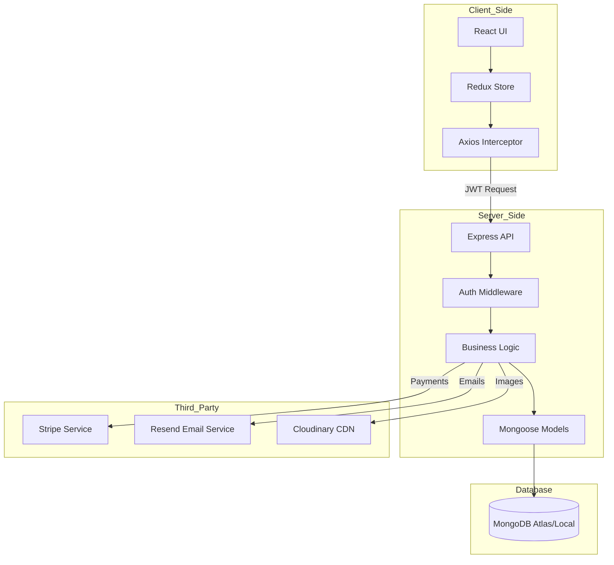
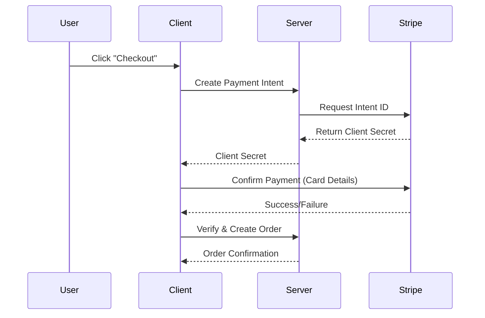

# ApniMart - Premier E-commerce Application

<div align="center">


---


</div>

**ApniMart** is a cutting-edge, full-stack e-commerce platform engineered for scalability and performance. It delivers a rich user experience with secure transactions, real-time updates, and an intuitive administrative interface.

> "Empowering local businesses with global reach."

---

## 📥 Asset Download

Top-tier visual assets and design resources are available for this project.
[**📂 Download Official Image Assets**](https://drive.google.com/drive/folders/1llzO3ts3NJKrQ0A2XWZYaO-T0Qnyq6yO)

---

## 🎥 Application Preview

|      Desktop View      |      Mobile View       |
| :--------------------: | :--------------------: |
|  |  |

---

## ✨ Key Features

### 👤 For Customers

- **Secure Authentication**: Role-based login (User/Admin) with JWT and refresh tokens.
- **Dynamic Product Search**: Advanced filtering by category, sub-category, and price.
- **Smart Cart System**: Real-time cart updates preventing stock conflicts.
- **Seamless Checkout**: Integrated Stripe payment gateway for secure transactions + Cash on Delivery support.
- **Order Tracking**: Real-time status updates on orders.
- **Responsive Design**: Mobile-first approach using Tailwind CSS.

### 🛡️ For Administrators

- **Product Management**: CRUD operations for products, categories, and subcategories.
- **Product Seeding**: Automated script to populate database from local directory structure with image upload.
- **Order Dashboard**: View and manage order statuses.
- **User Management**: Monitor user activity and details.

---

## 🏗️ System Architecture

The application is built on a decoupled **MERN** (MongoDB, Express, React, Node.js) architecture.



### 🛠️ Tech Stack & Dependencies

| Area         | Technology        | Purpose                        |
| :----------- | :---------------- | :----------------------------- |
| **Frontend** | **React.js**      | Component-based UI library     |
|              | **Vite**          | Fast build tool and dev server |
|              | **Redux Toolkit** | State management               |
|              | **Tailwind CSS**  | Utility-first CSS framework    |
|              | **Axios**         | HTTP Client                    |
| **Backend**  | **Node.js**       | Javascript Runtime             |
|              | **Express.js**    | Web Framework                  |
|              | **Mongoose**      | ODM for MongoDB                |
|              | **JWT**           | Secure Authentication          |
| **DevOps**   | **Vercel**        | Deployment (Client/Server)     |

---

## 📂 Folder Structure

```
d:\ApniMart
├── client/                 # Frontend React Application
│   ├── src/
│   │   ├── assets/         # Static images and icons
│   │   ├── components/     # Reusable UI components
│   │   ├── layouts/        # Page layouts (Admin/User)
│   │   ├── pages/          # Application views
│   │   ├── redux/          # Global state slices
│   │   ├── routes/         # Router configuration
│   │   └── utils/          # Helper functions
│   └── ...
├── server/                 # Backend Node.js API
│   ├── config/             # Database & Service configs
│   ├── controllers/        # Request handlers
│   ├── middleware/         # Auth & Validation
│   ├── models/             # Database Schemas
│   ├── route/              # API Route definitions
│   └── utils/              # Common utilities
└── README.md
```

---

## 🔄 Core Workflows

### 🔐 Authentication Flow

1.  User submits credentials.
2.  Server validates with **Bcrypt**.
3.  **Access Token** (short-lived) & **Refresh Token** (long-lived) generated.
4.  RefreshToken stored in HTTP-Only Cookie; AccessToken sent to Client.

### 🛒 Checkout Flow



---

## 🚀 Installation & Setup Guide

### 1. Prerequisites

Ensure you have the following installed:

- [Node.js](https://nodejs.org/en/) (v16.x or higher)
- [MongoDB](https://www.mongodb.com/try/download/community) (Local or Atlas URI)
- [Git](https://git-scm.com/)

### 2. Clone Repository

```bash
git clone https://github.com/mausamkar/apnimart.git
cd apnimart
```

### 3. Environment Configuration

You **MUST** create `.env` files in both root directories.

**Backend** (`server/.env`)

```ini
MONGODB_URI=mongodb://localhost:27017/apnimart
PORT=8080
FRONTEND_URL=http://localhost:5173
SECRET_KEY_ACCESS_TOKEN=input_your_random_access_token_secret_here
SECRET_KEY_REFRESH_TOKEN=input_your_random_refresh_token_secret_here
RESEND_API=re_123456789
STRIPE_SECRET_KEY=sk_test_123456789
CLODINARY_CLOUD_NAME=your_cloud_name
CLODINARY_API_KEY=your_api_key
CLODINARY_API_SECRET_KEY=your_api_secret
```

**Frontend** (`client/.env`)

```ini
VITE_API_URL=http://localhost:8080
VITE_STRIPE_PUBLIC_KEY=pk_test_123456789
```

### 4. Install & Run

Open two terminal windows.

**Terminal A (Server)**

```bash
cd server
npm install
npm run dev
# Server runs on Port 8080
```

**Terminal B (Client)**

```bash
cd client
npm install
npm run dev
# Client runs on Port 5173
```

### 5. (Optional) Seed Products

To populate your database with products from a `product` directory:

1.  Ensure your `product` folder is in the project root.
2.  Run the seeding script:

```bash
cd server
node seedProducts.js
```

This script will:

- Iterate through Categories -> SubCategories -> Products.
- Upload images to Cloudinary.
- Create database entries.

---

## 📡 API Documentation (Preview)

| Method | Endpoint              | Description              | Auth Required |
| :----- | :-------------------- | :----------------------- | :-----------: |
| `POST` | `/api/user/register`  | Register new user        |      ❌       |
| `POST` | `/api/user/login`     | User login               |      ❌       |
| `GET`  | `/api/product/get`    | Fetch all products       |      ❌       |
| `POST` | `/api/cart/create`    | Add item to cart         |      ✅       |
| `POST` | `/api/order/checkout` | Initiate Stripe checkout |      ✅       |

---

## 📜 License & Legal

This software is strictly governed by a custom proprietary license.

**© 2025 Mausam Kar. All Rights Reserved.**

Unauthorized copying, modification, distribution, or use of this software for commercial purposes is strictly prohibited. See [LICENSE](./LICENSE) for full details.

---

## 👤 Author Contact

**Mausam Kar**

- 🌐 **Website**: [ApniMart Official](https://apnimart.com)
- 🐙 **GitHub**: [@mausamkar](https://github.com/mausamkar)
- 📧 **Email**: contact@mausamkar.com
