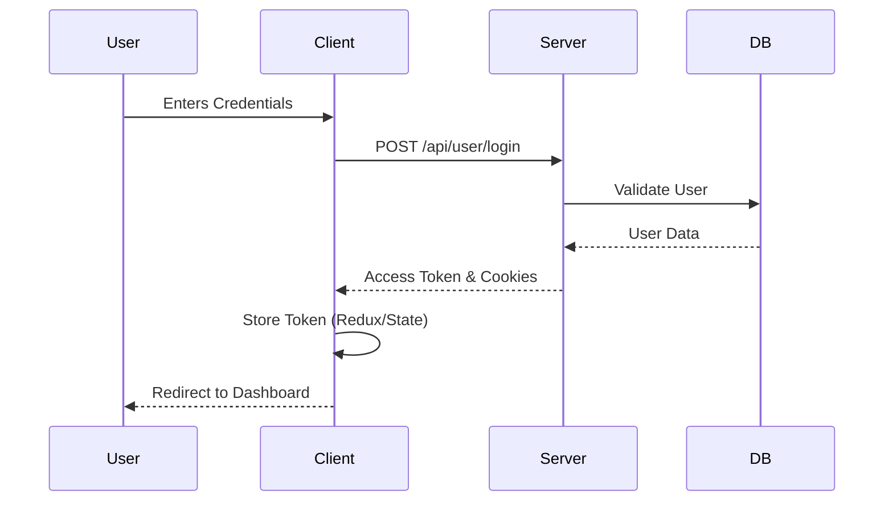
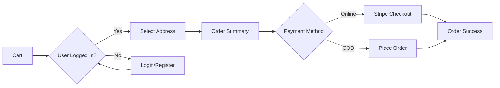

# ApniMart - E-commerce Application


**ApniMart** is a comprehensive full-stack e-commerce solution designed to provide a seamless shopping experience. Built with modern web technologies, it features a robust backend, a dynamic frontend, and secure payment integrations.

---

## 📥 Download Assets

[**Download Image Assets**](https://drive.google.com/drive/folders/1llzO3ts3NJKrQ0A2XWZYaO-T0Qnyq6yO)

---

## 🏗️ Architecture

The application follows a client-server architecture with a RESTful API.

```mermaid
graph TD
    Client[Client (React + Vite)]
    Server[Server (Node.js + Express)]
    DB[(MongoDB)]
    Ext[External Services]

    Client -- HTTP Requests --> Server
    Server -- Queries --> DB
    Server -- API Calls --> Ext

    subgraph Services
        Stripe[Stripe Payments]
        Resend[Resend Emails]
        Cloudinary[Cloudinary Images]
    end

    Ext --> Stripe
    Ext --> Resend
    Ext --> Cloudinary
```

### Tech Stack

| Component    | Technologies                                          |
| :----------- | :---------------------------------------------------- |
| **Frontend** | React, Vite, Redux Toolkit, Tailwind CSS, Axios       |
| **Backend**  | Node.js, Express.js, Mongoose, JWT                    |
| **Database** | MongoDB                                               |
| **Services** | Stripe (Payments), Resend (Email), Cloudinary (Media) |

---

## 🔄 User Flowcharts

### Authentication Flow



### Checkout Process



---

## 🚀 Getting Started

### Prerequisites

- Node.js (v16+)
- MongoDB (Local or Atlas)
- NPM or Yarn

### Installation

1.  **Clone the repository**

    ```bash
    git clone https://github.com/mausamkar/apnimart.git
    cd apnimart
    ```

2.  **Environment Setup**
    Create `.env` files in both `server` and `client` directories.

    _Server (`server/.env`)_

    ```ini
    MONGODB_URI=your_mongodb_uri
    PORT=8080
    FRONTEND_URL=http://localhost:5173
    SECRET_KEY_ACCESS_TOKEN=your_access_token_secret
    SECRET_KEY_REFRESH_TOKEN=your_refresh_token_secret
    RESEND_API=your_resend_api_key
    STRIPE_SECRET_KEY=your_stripe_secret_key
    CLODINARY_CLOUD_NAME=your_cloud_name
    CLODINARY_API_KEY=your_cloudinary_key
    CLODINARY_API_SECRET_KEY=your_cloudinary_secret
    ```

    _Client (`client/.env`)_

    ```ini
    VITE_API_URL=http://localhost:8080
    VITE_STRIPE_PUBLIC_KEY=your_stripe_public_key
    ```

3.  **Install Dependencies**

    ```bash
    # Server
    cd server
    npm install

    # Client
    cd ../client
    npm install
    ```

4.  **Run Application**

    ```bash
    # Open two terminals

    # Terminal 1 (Server)
    cd server
    npm run dev

    # Terminal 2 (Client)
    cd client
    npm run dev
    ```

---

## 📜 License

This project is licensed under a custom proprietary license. See the [LICENSE](LICENSE) file for details.

**Copyright (c) 2025 Mausam Kar**

---

## 👤 Author

**Mausam Kar**

- Website: [ApniMart](https://apnimart.com)
- GitHub: [@mausamkar](https://github.com/mausamkar)

---

_Generated by Antigravity_
